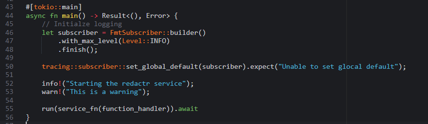
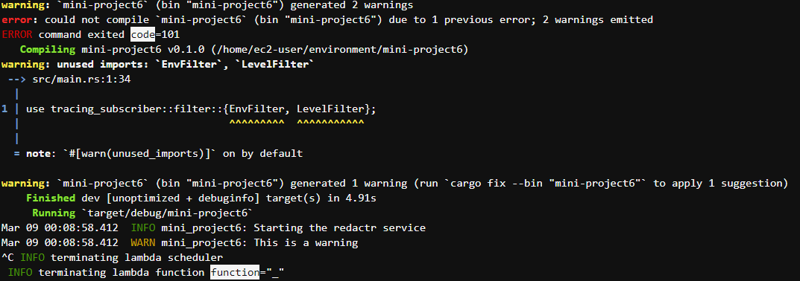
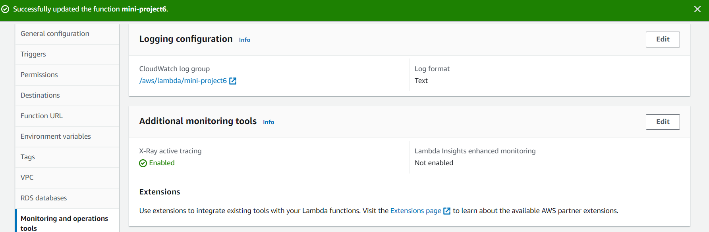
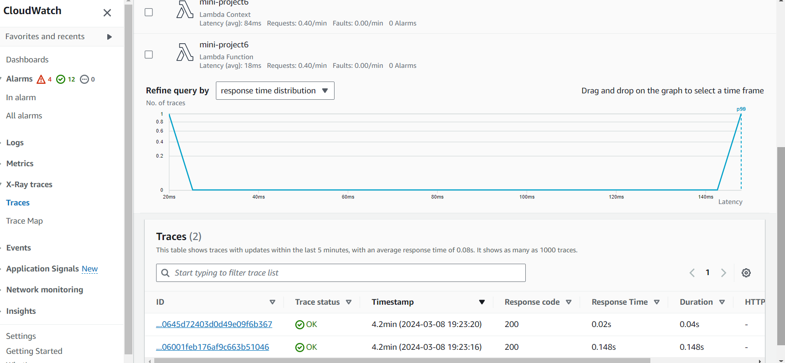
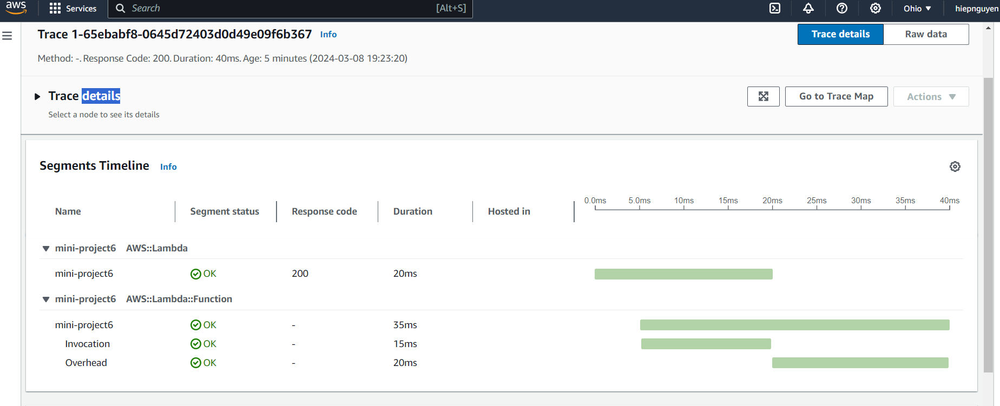

# Mini-project Week 6

## Target 
- Add logging to a Rust Lambda function
- Integrate AWS X-Ray tracing
- Connect logs/traces to CloudWatch

## Lambda Function:
The lambda function takes two integers and returns the multiplication of them.

## Guidelines:
1. Having a Rust Lambda Function ready.
2. Modify the dependencies in cargo.toml:

    ```
    tracing = "0.1.37"
    tracing-subscriber = "0.2.0"
    ```
    
3. Add these code at the beginning of the main function in main.rs:
    ```
    // Initialze logging
    let subscriber = FmtSubscriber::builder()
        .with_max_level(Level::INFO)
        .finish();
    
    tracing::subscriber::set_global_default(subscriber).expect("Unable to set glocal default");
    
    info!("Starting the redactr service");
    warn!("This is a warning");
    ```
4. Build and deploy the lambda function to AWS with the IAM role consisting of these permissions: AWSLambda_FullAccess, AWSLambdaBasicExecutionRole, IAMFullAccess, AWSXRayDaemonWriteAccess

5. Enable the AWS X-Ray tracing in `Lambda -> Configuration -> Monitoring and operations tools`.

6. Test the logging and X-Ray tracing with:
    ```
    cargo lambda watch
    ```
Then test with (for remote access to AWS):
    ```
    cargo lambda invoke --remote mini-project6 --data-ascii "{\"x\":-1, \"y\":21 }"
    ```
Then you can go to AWS and check for logging and traces in the Monitor section of the AWSLambda.

## Here are some screenshots

### Rust main src code:


### Terminal logging:


### AWS X-Ray:


### CloudWatch:


### Tracing:

    

